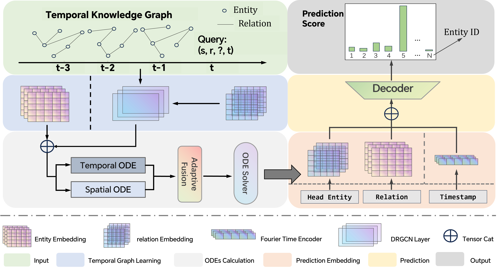

# SIGMOD26-STAGEN: Decoupled Causal Reasoning in Temporal Knowledge Graphs

STAGEN is a novel framework for temporal knowledge graph reasoning that combines dynamic graph attention networks with neural ordinary differential equations to model the continuous evolution of entity and relation representations over time.

**Abstract:**
 Temporal knowledge graph reasoning faces critical challenges in modeling complex spatio-temporal interactions and resisting temporal distribution shifts. We propose STAGEN (Spatio-Temporal Augmented Graph Evolution Network), a novel architecture that innovatively integrates multiscale ODEs with causal contrastive learning. First, we decouple the dynamics modeling into spatial topology evolution and temporal feature propagation through a dual-stream ODE structure, enabling precise capture of both local structural changes and global pattern transitions. Second, we design a dynamic relation-aware graph convolutional layer combined with multi-head attention to effectively model time-varying relation dependencies. Third, we introduce a causal intervention mechanism in counterfactual contrastive learning to enhance the model’s robustness against temporal perturbations. Experiments on three benchmark datasets demonstrate state-of-the-art performance of our model,with an MRR improvement of 11.03% compared to baseline methods.


**Features:**

* **Dynamic Relation-Aware Graph Convolution Network Layer:** We propose an MST-ODE module that independently models local structural variations and global temporal evolution. This decoupling facilitates a granular representation of spatio-temporal evolution, enabling the model to capture nuanced, scale-dependent dynamics. The multi-scale nature of the module allows for the integration of information from various spatial and temporal resolutions, thereby enhancing the model's capacity to represent intricate spatio-temporal dependencies.
* **Multi-Scale Spatio-Temporal Decoupled ODE Module:** We develop a DRGCN layer that incorporates a spatio-temporal attention mechanism, enabling the model to adaptively modulate the influence of different relationship types and temporal stamps. This dynamic adjustment enhances the expressive power of graph convolution, allowing for more nuanced and context-aware information propagation.
* **Causal Contrastive Learning** Leveraging causal intervention principles \cite{zhao2021causal}, we introduce a CCL strategy to mitigate the impact of spurious correlations and reinforce temporal reasoning. By explicitly intervening on potential confounding factors, we enhance the model's ability to discern genuine causal relationships, thereby improving prediction accuracy and robustness.

**Requirements:**

* Python 3.8+
* PyTorch 1.12+
* torch-scatter
* torchdiffeq

## Dataset
There are five datasets (from [RE-NET](https://github.com/INK-USC/RE-Net)): ICEWS18, ICEWS14, GDELT, WIKI, and YAGO. Times of test set should be larger than times of train and valid sets. (Times of valid set also should be larger than times of train set.) Each data folder has 'stat.txt', 'train.txt', 'valid.txt', 'test.txt'.

**Usage:**

1.  Prepare your dataset in the `data/` folder.
2.  Train the model:
    ```bash
    python main.py
    ```

**Key configuration options in `config.py`:**

* `time_windows`: Number of temporal windows
* `hidden_dim`: Embedding dimension
* `time_horizon`: Prediction time horizon
* `tau`: Temperature parameter for contrastive loss

**`stagen/` directory structure:**

├── model/config.py       # Configuration settings

├── model/model.py        # Core model architecture

├── model/trainer.py      # Training logic

├── model/evaluate.py     # Evaluation metrics

├── model/util.py         # Data utilities

├── model/main.py         # Main entry point

└── data/           # Dataset folder

